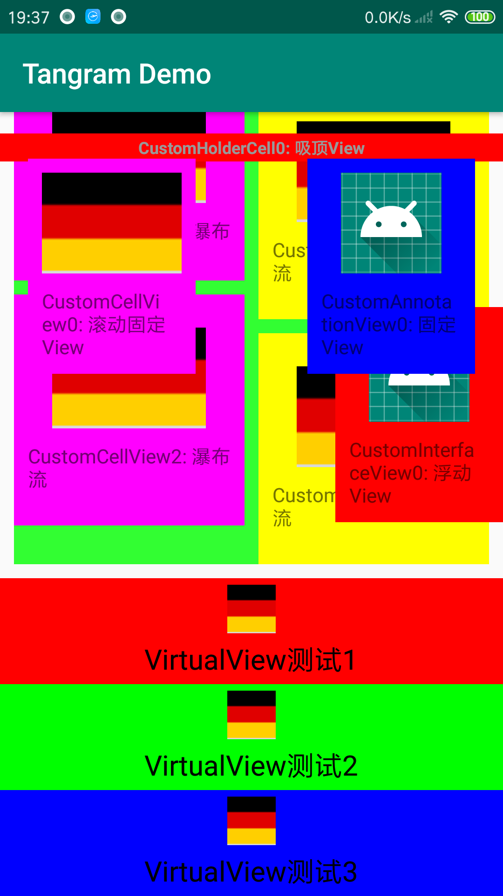
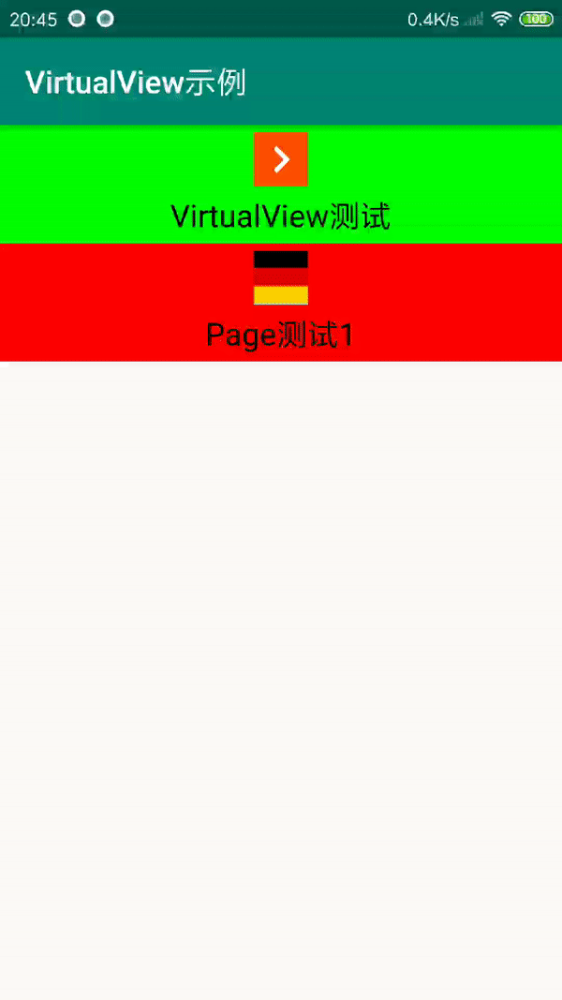

# TangramDemo
> Android动态界面开发框架Tangram及VirtualView使用示例
## 教程
[Android动态界面开发框架Tangram使用完整教程](https://blog.csdn.net/u013541140/article/details/89517186)

[Android动态界面开发框架VirtualView使用完整教程](https://blog.csdn.net/u013541140/article/details/89519912)

[Android动态界面开发框架VirtualView之Page、Scroller数据绑定](https://blog.csdn.net/u013541140/article/details/90488516)
## 截图

